Hi there 👋. My name is Óscar Criado de la Torre.

I've spent the last 5+ years working as Senior Software Engineer into 📡 GNSS (_Global Navigation Satellite Systems_) in the most impact European projects:

* 🚓 __GRC (_Galileo Reference Centre_)__: In this project, we act as guardians of Galileo constellation, monitoring and reporting to the European Comission.

* 🚀 __TGVF-X (_Time and Geodetic Validation Facility - Explotation Phase_)__ : This project is like a sandbox of new algorithms to be apply into future generations of Galileo constellation and monitoring the performance of the current version of satellites to detect and analyse any anomaly in their behaviour.

* 🔒 __GSC (_Galileo Service Centre_)__: This project is the point of contact of Galileo users and the segment, providing reference documentation, products and services such as _OSNMA_ and _HAS_:
  * OSNMA (_Open Service Navigation Message Authentication_): This service ensures that the signal received is coming from a GNSS satellite.
  * HAS (_High Accuracy Service_): This service provides a set of measurements providing a positioning precision under 10 cm.

### 🔗 Social Networks

### :octocat: Github Statistics

  

